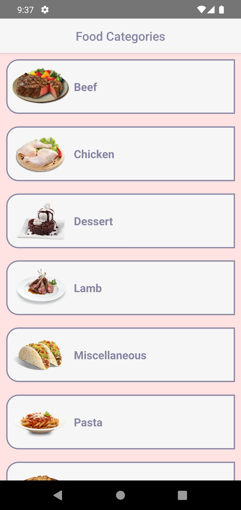
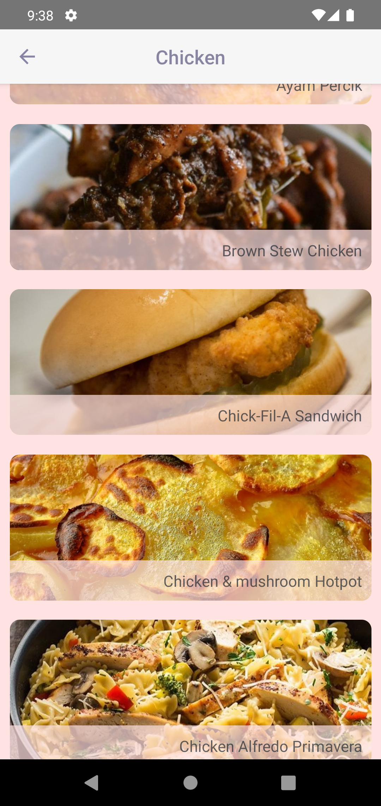
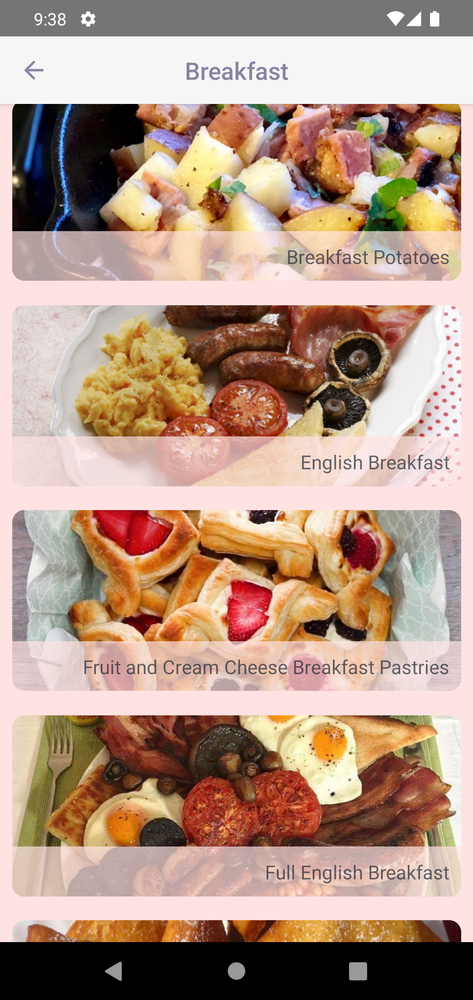
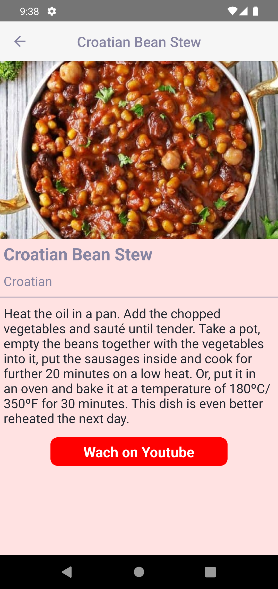
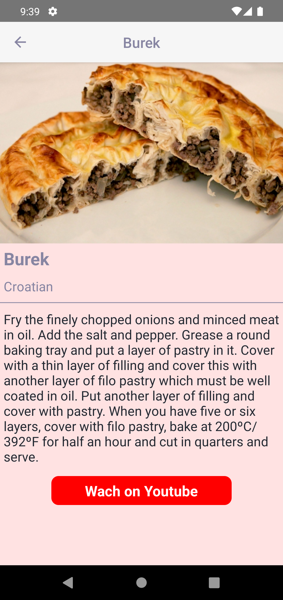

# __Tarifler__

## A simple food recipe app made with React Native

## Using fake api for the meal categories, meals and meal thumbs.

[__TheMealDb__](https://www.themealdb.com/api.php)

## Added dynamic head titles

